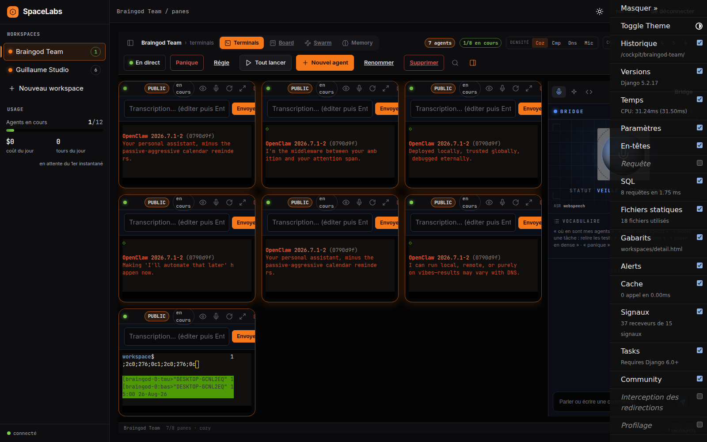
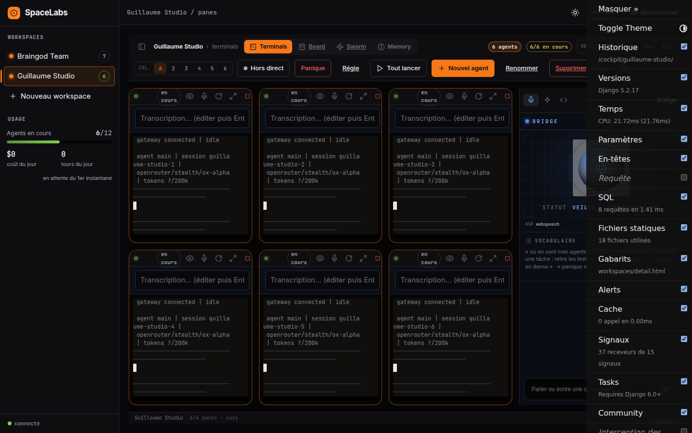
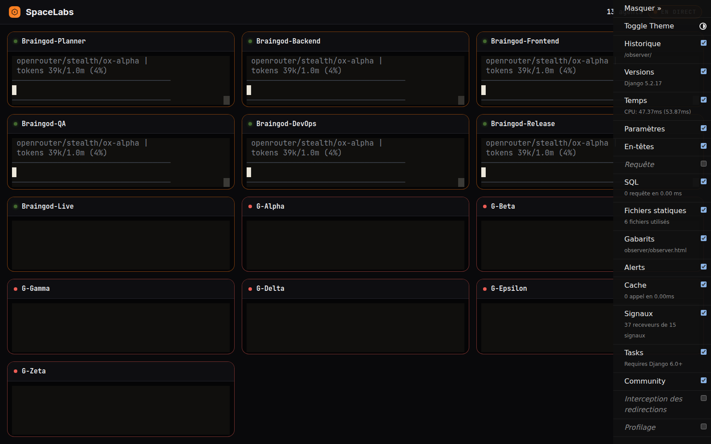
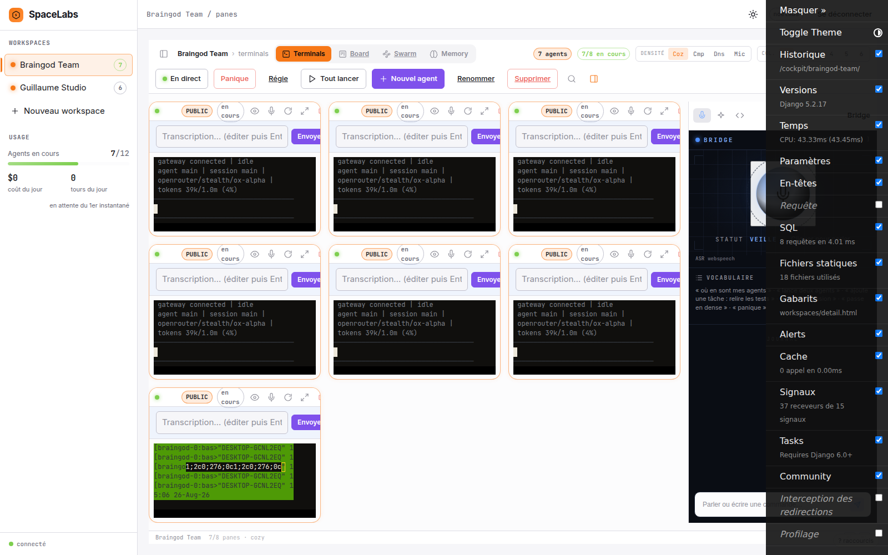

# SpaceLabs

**Le cockpit web local-first pour piloter une flotte d'agents IA depuis votre navigateur.**

Des dizaines d'agents qui codent, testent et livrent en parallèle sur votre machine.
Vous les observez du coin de l'œil, vous intervenez quand vous le décidez, vous
reprenez la main à tout instant.



---

## L'objectif

Les agents IA de développement sont devenus autonomes. Le problème n'est plus de
*lancer* un agent — c'est de **piloter une flotte** :

- où est chaque agent ? dans quel repo ? sur quelle tâche ?
- lequel a fini, lequel bloque, lequel déraille ?
- comment reprendre la main sans perdre le contexte ?

SpaceLabs répond à ces trois questions avec un principe simple : **un pane par
agent, un mur d'agents par écran**. La sortie des agents est le contenu ;
l'interface est un cadre et s'efface.

## Ce que ça fait

| Capacité | Détail |
|---|---|
| **Panes terminal temps réel** | Vrai PTY dans le navigateur (WebSocket + Channels), buffer rejoué à la reconnexion |
| **Reprise de session** | F5, crash navigateur, redémarrage serveur : la grille se restaure, l'historique revient, `--continue` relance exactement où c'était |
| **Multi-workspaces** | Plusieurs projets côte à côte, plafond configurable par workspace et par compte |
| **Chat headless** | Mode conversationnel `stream-json` : bulles, outils repliables, coût/durée, persistance intégrale |
| **Vue spectateur** | `/observer/` — SSE anonyme read-only, rédaction serveur des panes privés, pensé pour le live streaming |
| **Commande vocale** | Push-to-talk fr-FR par pane ; option 100% offline via CrisperWhisper |
| **Missions & Tasker** | Orchestration déclarative : un Master Tasker distribue le travail aux agents |
| **Exploitation** | Celery + beat : faucheur de zombies, snapshots d'usage, archivage, réconciliation au boot |



## Aucune clé API

SpaceLabs spawne les binaires CLI déjà authentifiés sur **votre** machine
(`claude`, ou toute CLI de votre liste blanche — ex. `openclaw`). Pas
d'intermédiaire, pas de token qui transite : vos abonnements, vos crédits,
vos credentials restent chez vous (`~/.claude`, etc.).

La liste blanche `COCKPIT_ALLOWED_CMDS` décide seul de ce qui est spawnable.

## Démarrer

```bash
make setup    # dépendances + migrations + utilisateur local « pilote »
make redis    # (optionnel en dev) Redis via docker compose
make run      # daphne sur http://127.0.0.1:8000
```

Connexion : `pilote` / `cockpit-local` (change-le). La page cockpit ouvre un
pane terminal qui lance `COCKPIT_DEFAULT_CMD` dans un vrai PTY — ferme l'onglet,
reviens : la session continue et l'historique est rejoué.

Configuration : copie `.env.example` → `.env`. Variables clés :
`COCKPIT_DEFAULT_CMD`, `COCKPIT_ALLOWED_CMDS`, `COCKPIT_MAX_PANES`,
`COCKPIT_OWNER_MAX_PANES`, `REDIS_URL`, `ALLOWED_HOSTS`.

### Mode « full matrix » (streaming)

Pour suivre 13+ agents simultanément et diffuser l'écran en live :

```bash
# .env
COCKPIT_OWNER_MAX_PANES=16
COCKPIT_OBSERVER_MAX_TILES=16
```

Puis active le mode live et partage `/observer/` — tuiles publiques expurgées,
placeholders pour le privé, bouton panique.



## Architecture en bref

- **Django 5.2 + Channels/Daphne** — ASGI, WebSockets, SSE
- **PTY noyau maison** — spawn, replay, reprise, kill propre, isolation par utilisateur
- **MTI + registre polymorphe** — `PtyPane` / `HeadlessPane`, dispatch sans `isinstance`
- **Celery** — exploitation depuis la base, source de vérité unique
- **Design system 2 thèmes** — densité assumée, état lisible en périphérie (voir `BRAND.md`)



## Sécurité — à lire avant d'exposer quoi que ce soit

Ce cockpit **exécute des process avec vos droits utilisateur** :

- ne l'exposez **jamais** sur Internet — LAN de confiance uniquement ;
- `COCKPIT_ALLOWED_CMDS` est la liste blanche : n'y mettez que des binaires assumés ;
- `--dangerously-skip-permissions` retire les garde-fous de l'agent : choix explicite,
  répertoires maîtrisés (voir `SECURITY.md`) ;
- la vue spectateur est **privée par défaut** : rien ne sort sans activation du mode live.

## État — Sprint 7

Fonctionnalités détaillées dans [`CHANGELOG.md`](CHANGELOG.md), cap dans
[`ROADMAP.md`](ROADMAP.md). Contributions bienvenues — lire
[`CONTRIBUTING.md`](CONTRIBUTING.md) puis ouvrir une issue.

## Licence

MIT — voir [LICENSE](LICENSE).
